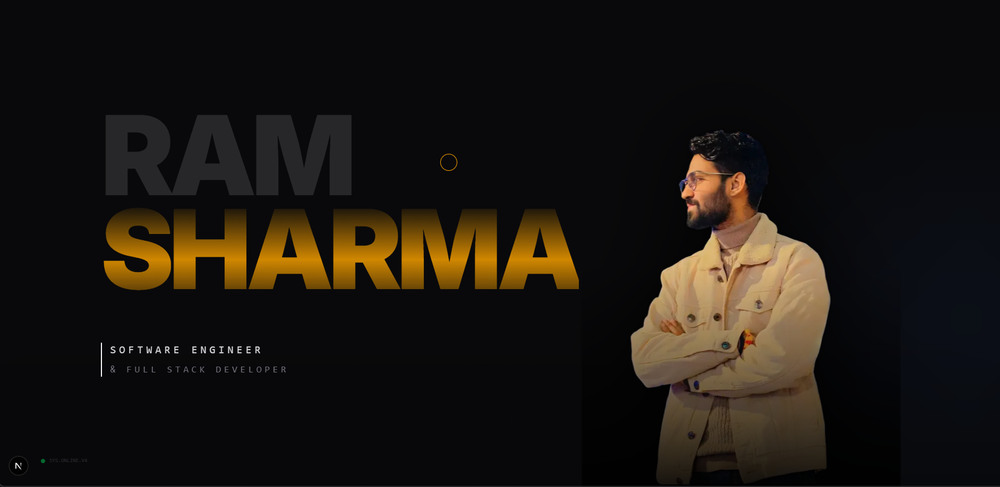

# Cinematic Developer Portfolio Template ⚡

A high-performance, immersive developer portfolio template built for the community by **Ram Sharma**.

Designed with **Next.js 14**, **Tailwind CSS**, and **GSAP**, this template helps software engineers showcase their work with a premium, "living" aesthetic.



## 🌟 Introduction

> **Live Demo:** [https://cinematic-portfolio-template.netlify.app/](https://cinematic-portfolio-template.netlify.app/)

I created this project as a robust, open-source foundation for developers who want to stand out. It goes beyond static sites, offering a "Titan" design language that feels alive.

## ✨ Key Features

### 1. "Titan" Hero Layout

- **Split Grid System**: A strict 7-column (typography) / 5-column (image) grid ensures your name and image never overlap, maintaining a perfect magazine-style composition on all screen sizes.
- **Scramble Effect**: A custom hook (`useScramble`) decrypts your name with a "Cyber Warp" effect, settling into a solid state.
- **Parallax**: Mouse-driven 3D parallax adds depth to the background layers without compromising performance.

### 2. Titan Precision Cursor

- **Physics Engine**: Abandoning standard CSS transitions for a custom GSAP ticker loop to ensure zero lag.
- **Squash & Stretch**: The cursor elongates based on velocity, giving a "warp speed" feel as you move.
- **Interactive States**:
  - _Default_: Gold Diamond + Rotating Tech Ring.
  - _Hover_: The Diamond expands and locks on, while the ring snaps tight.

### 3. Connectivity Hub

- **No Forms**: Replaced generic contact forms with a "Direct Connect" philosophy.
- **Magnetic Core**: The email button uses magnetic physics to pull towards your cursor.
- **Orbiting Nodes**: Social links orbit the core, pulsing with ambient light.

### 4. Performance First

- **Lenis Scrolling**: Smooth, momentum-based scrolling that feels heavy and premium.
- **GPU Acceleration**: All animations use `transform` and `opacity` to avoid layout thrashing.
- **Dynamic Loading**: Heavy assets are loaded intelligently to keep the TTI (Time to Interactive) low.

## 🛠️ Tech Stack

- **Framework**: [Next.js 14](https://nextjs.org/) (App Router, TypeScript)
- **Styling**: [Tailwind CSS v4](https://tailwindcss.com/)
- **Animation**:
  - [GSAP](https://gsap.com/) (ScrollTrigger, Flip)
  - [Lenis](https://lenis.darkroom.engineering/) (Smooth Scroll)
- **Icons**: [Lucide React](https://lucide.dev/)
- **Fonts**: Inter (Google Fonts)

## 🚀 Getting Started

### Prerequisites

- Node.js 18+
- npm or yarn

### Installation

1.  **Clone the repository**:

    ```bash
    git clone https://github.com/sharmaram25/cinematic-portfolio.git
    cd cinematic-portfolio
    ```

2.  **Install dependencies**:

    ```bash
    npm install
    # or
    yarn install
    ```

3.  **Run the development server**:
    ```bash
    npm run dev
    ```
    Open [http://localhost:3000](http://localhost:3000) (or port 8080 if configured) to view it in the browser.

## 🎨 Customization

### 1. Hero Image

Replace `public/ram.webp` with your own cutout image. Ensure it is a high-resolution transparent PNG/WEBP.

- **Tip**: Use a drop shadow on your PNG for better depth integration.

### 2. Personal Styling

Adjust colors in `src/app/globals.css` or `tailwind.config.ts`. The project uses a semantic color system:

- `gold`: Primary accent
- `zinc-950`: Background base

### 3. Project Data

Update `src/components/projects/Projects.tsx` with your own case studies. The layout automatically handles horizontal scrolling logic.

### 4. Contact Links

Modify `src/components/contact/Contact.tsx` to update your email and social handles.

## 📦 Deployment

This project is optimized for deployment on **Vercel**.

1.  Push your code to GitHub.
2.  Import the project into Vercel.
3.  Vercel will automatically detect Next.js settings.
4.  Hit **Deploy**.

## 🤝 Contributing

Contributions are welcome! Please feel free to submit a Pull Request.

## 📄 License

This project is open source and available under the [MIT License](LICENSE).

---

**Created for the Community by [Ram Sharma](https://twitter.com/ram_dev).**
_Crafted with precision code._
